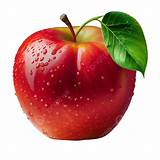

This program takes a "real" image, which could be
colorful, or grayscale, and turns it into an
image drawn by ascii characters.

# Demo

Original image:


ASCII image:

[lena_ascii](img/lena.ascii.txt)

Original image:



ASCII image:

[apple_ascii](img/apple.ascii.txt)

# Get Started

```Bash
$ git clone https://github.com/LIU-Xnd/asciidraw.git

$ cd asciidraw/

$ pip install -r requirements.txt

$ python ./src/asciidraw.py ./img/lena.jpeg
```

See help:

```Bash
$ python ./src/asciidraw.py -h
```